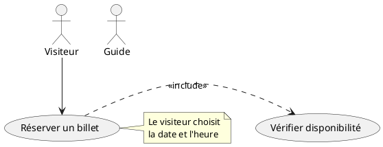
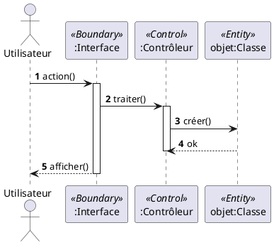
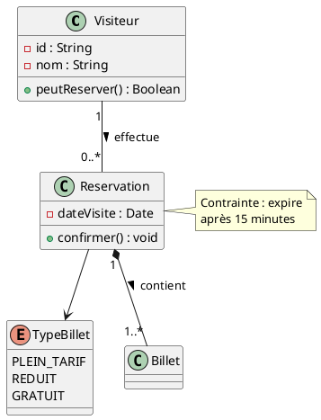
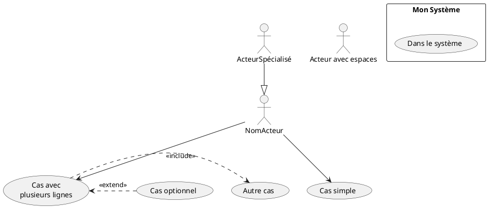
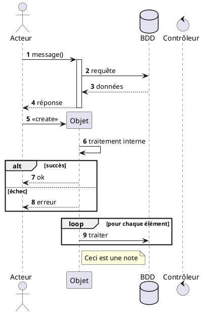
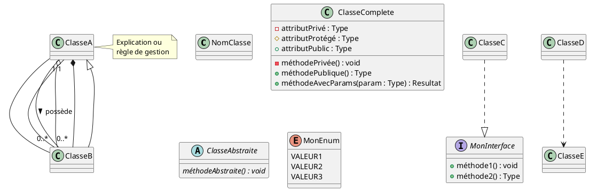
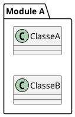
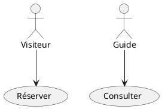

# Guide PlantUML pour le Projet

Ce guide vous explique comment utiliser PlantUML pour créer vos diagrammes UML dans le cadre du projet.

---

## 🎯 Pourquoi PlantUML ?

PlantUML est un outil qui permet de créer des diagrammes UML à partir de texte simple. Avantages :

✅ **Facilement versionnable** : Les fichiers sont du texte, donc parfaits pour Git  
✅ **Reproductible** : Le même code génère toujours le même diagramme  
✅ **Collaboratif** : Facile de voir les modifications entre versions  
✅ **Rapide** : Plus rapide que de dessiner à la souris  
✅ **Professionnel** : Rendu de qualité publication  

---

## 📖 Les 3 Diagrammes du Projet

### 1. Diagramme de Cas d'Utilisation (Semaines 2-3)

**Fichier** : `plantuml/diagramme_cas_utilisation.puml`

**Éléments clés** :


**À adapter pour votre projet** :
- Remplacez les acteurs par ceux de votre système
- Ajoutez vos cas d'utilisation
- Précisez les relations include/extend

### 2. Diagramme de Séquence (Semaines 4-5)

**Fichier** : `plantuml/diagramme_sequence_reservation.puml`

**Éléments clés** :


**À adapter pour votre projet** :
- Sélectionnez 3-5 cas d'utilisation clés
- Identifiez les participants (Boundary, Control, Entity)
- Décrivez les interactions pas à pas

### 3. Diagramme de Classes (Semaines 6-7)

**Fichier** : `plantuml/diagramme_classes_musee.puml`

**Éléments clés** :


**À adapter pour votre projet** :
- Identifiez vos classes métier
- Définissez attributs et méthodes principales
- Établissez les relations avec multiplicités

---

## 🛠️ Installation et Outils

### Option 1 : Éditeur en ligne (Le plus simple)

**PlantUML Online Editor** : [http://www.plantuml.com/plantuml/uml](http://www.plantuml.com/plantuml/uml)

1. Copiez le code PlantUML
2. Collez dans l'éditeur
3. Visualisez instantanément
4. Exportez en PNG/SVG/PDF

### Option 2 : Visual Studio Code (Recommandé)

1. **Installez VS Code** : [https://code.visualstudio.com/](https://code.visualstudio.com/)

2. **Installez l'extension PlantUML** :
   - Ouvrez VS Code
   - Allez dans Extensions (Ctrl+Shift+X)
   - Cherchez "PlantUML" de jebbs
   - Cliquez sur "Install"

3. **Utilisez l'extension** :
   - Ouvrez un fichier .puml
   - Appuyez sur `Alt+D` pour prévisualiser
   - Le diagramme s'affiche à côté du code

4. **Exportez le diagramme** :
   - Clic droit dans le diagramme
   - "Export Current Diagram"
   - Choisissez le format (PNG, SVG, PDF)

### Option 3 : IntelliJ / PyCharm

1. Installez le plugin "PlantUML integration"
2. Le diagramme s'affiche automatiquement
3. Exportez via le menu contextuel

---

## 📋 Syntaxe de Base

### Diagramme de Cas d'Utilisation



### Diagramme de Séquence



### Diagramme de Classes



---

## 🎨 Personnalisation

### Couleurs et styles

```plantuml
@startuml
' Couleur d'une classe
class MaClasse #LightBlue

' Couleur d'un acteur
actor MonActeur #Pink

' Style global
skinparam class {
    BackgroundColor LightYellow
    BorderColor Navy
    ArrowColor Red
}

skinparam sequence {
    ParticipantBackgroundColor LightBlue
    LifeLineBorderColor Blue
}

@enduml
```

### Stéréotypes

```plantuml
@startuml
class MaClasse <<Entity>>
class AutreClasse <<Control>>
participant ":Interface" <<Boundary>>
@enduml
```

### Disposition



---

## ✅ Checklist pour vos Diagrammes

### Diagramme de Cas d'Utilisation
- [ ] Tous les acteurs sont identifiés
- [ ] Tous les cas d'utilisation majeurs sont présents
- [ ] Les relations include/extend sont correctes
- [ ] Le système est clairement délimité
- [ ] Des notes expliquent les points complexes

### Diagramme de Séquence
- [ ] Les participants sont correctement typés (Boundary/Control/Entity)
- [ ] La numérotation automatique est activée
- [ ] Les activations/désactivations sont cohérentes
- [ ] Les messages de retour sont présents
- [ ] Le scénario est complet du début à la fin

### Diagramme de Classes
- [ ] Toutes les classes métier sont présentes
- [ ] Les attributs ont leur visibilité et type
- [ ] Les méthodes principales sont documentées
- [ ] Les relations ont des multiplicités
- [ ] Les énumérations sont définies
- [ ] Les contraintes sont notées

---

## 💡 Astuces et Bonnes Pratiques

### 1. Commencez Simple

```plantuml
' Version 1 : Structure de base
@startuml
class A
class B
A -- B
@enduml

' Version 2 : Ajout des détails
@startuml
class A {
  - id : int
}
class B {
  - nom : String
}
A "1" -- "*" B
@enduml
```


### 2. Utilisez les Commentaires
```plantuml
@startuml
' Ceci est un commentaire
' Les commentaires aident à s'y retrouver

actor Visiteur ' Acteur principal
usecase (Réserver) as UC1 ' Cas d'utilisation important
@enduml
```

### 3. Organisez avec des Sections


### 4. Testez Régulièrement
- Générez le diagramme après chaque modification importante
- Vérifiez que le rendu est lisible
- Ajustez la disposition si nécessaire

### 5. Versionnez Vos Fichiers
```bash
git add plantuml/*.puml
git commit -m "Ajout diagramme de classes"
```

---

## 🆘 Problèmes Courants

### Le diagramme est illisible
**Solution** : Simplifiez ou utilisez `left to right direction`

### Les flèches se croisent
**Solution** : Réorganisez l'ordre de déclaration des éléments

### Les noms sont trop longs
**Solution** : Utilisez des alias
```plantuml
usecase (Nom très long pour le cas d'utilisation) as UC1
actor --> UC1
```

### Le rendu ne fonctionne pas
**Solution** : Vérifiez que vous avez bien `@startuml` au début et `@enduml` à la fin

---

## 📚 Ressources Complémentaires

- **Documentation officielle** : [https://plantuml.com/fr/](https://plantuml.com/fr/)
- **Galerie d'exemples** : [https://real-world-plantuml.com/](https://real-world-plantuml.com/)
- **Forum d'aide** : [https://forum.plantuml.net/](https://forum.plantuml.net/)
- **Cheat sheet PDF** : [PlantUML Cheat Sheet](https://plantuml.com/fr/guide)

---

## 🎓 Pour Aller Plus Loin

Une fois à l'aise avec PlantUML, vous pouvez :
- Créer des diagrammes d'activité
- Générer des diagrammes d'état
- Faire des diagrammes de déploiement
- Intégrer PlantUML dans vos documentations Markdown

---

**Bon travail avec PlantUML ! 🚀**
