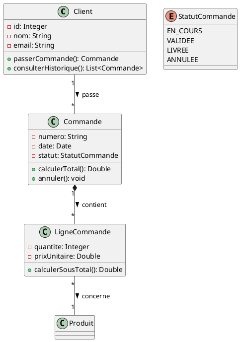

# Modèle de Diagramme de Classes

**Projet** : [Nom du projet]  
**Groupe** : [Noms des membres]  
**Version** : 1.0

---

## 1. Introduction

### 1.1 Objectif du document

Ce document présente le diagramme de classes métier du système [Nom du projet]. Il décrit la structure statique du système en identifiant :
- Les classes métier
- Leurs attributs
- Leurs méthodes
- Leurs relations

### 1.2 Périmètre

Le diagramme couvre les aspects métier du système. Les aspects techniques (DAO, services, contrôleurs) ne sont pas représentés.

### 1.3 Méthodologie

Les classes ont été identifiées à partir de :
- Glossaire métier (Semaine 1)
- Besoins fonctionnels (Semaine 2)
- Cas d'utilisation (Semaine 3)
- Diagrammes de séquence (Semaines 4-5)

---

## 2. Conventions de modélisation

### 2.1 Notation des classes

```
┌─────────────────────┐
│   NomClasse         │
├─────────────────────┤
│ - attribut1: Type   │
│ + attribut2: Type   │
│ # attribut3: Type   │
├─────────────────────┤
│ + methode1(): Type  │
│ - methode2(): void  │
└─────────────────────┘
```

### 2.2 Visibilité

- `+` **public** : accessible de partout
- `-` **private** : accessible uniquement dans la classe
- `#` **protected** : accessible dans la classe et ses sous-classes
- `~` **package** : accessible dans le même package

### 2.3 Types de relations

**Association** : `─────`
```
ClasseA ────── ClasseB
```

**Agrégation** : `◇─────` (losange vide)
```
ClasseA ◇────── ClasseB
```

**Composition** : `◆─────` (losange plein)
```
ClasseA ◆────── ClasseB
```

**Héritage** : `△─────` (triangle)
```
ClasseFille ─────△ ClasseParent
```

**Dépendance** : `- - - ->` (pointillés)
```
ClasseA - - - -> ClasseB
```

### 2.4 Multiplicités

- `1` : exactement un
- `0..1` : zéro ou un
- `*` ou `0..*` : zéro ou plusieurs
- `1..*` : un ou plusieurs
- `n..m` : entre n et m

---

## 3. Dictionnaire des classes

### 3.1 Domaine : [Nom du domaine fonctionnel]

#### Classe : [NomClasse1]

**Description** : [Description détaillée de la classe et de son rôle métier]

**Responsabilités** :
- [Responsabilité 1]
- [Responsabilité 2]

**Attributs** :
- `attribut1 : Type` - [Description]
- `attribut2 : Type` - [Description]
- `attribut3 : Type` - [Description]

**Méthodes** :
- `methode1() : Type` - [Description]
- `methode2(param: Type) : void` - [Description]

**Règles de gestion associées** :
- RG-XX : [Titre de la règle]
- RG-YY : [Titre de la règle]

**Contraintes** :
- [Contrainte 1]
- [Contrainte 2]

#### Classe : [NomClasse2]

[Répéter la structure pour chaque classe]

### 3.2 Domaine : [Autre domaine fonctionnel]

[Répéter pour chaque domaine]

---

## 4. Diagramme de classes complet

### 4.1 Vue globale

[Insérer ici le diagramme de classes complet avec toutes les classes et leurs relations]

**Légende** :
- Domaine 1 : [Couleur/Zone]
- Domaine 2 : [Couleur/Zone]
- Domaine 3 : [Couleur/Zone]

### 4.2 Notes sur le diagramme

**Organisation** :
- Les classes sont regroupées par domaine fonctionnel
- Les classes principales sont au centre
- Les classes périphériques sont disposées autour

**Conventions spécifiques** :
- [Convention 1]
- [Convention 2]

---

## 5. Diagrammes partiels par domaine

### 5.1 Domaine : [Nom du domaine 1]

[Insérer diagramme focalisé sur ce domaine]

**Classes du domaine** :
- [Classe A] : [Rôle]
- [Classe B] : [Rôle]
- [Classe C] : [Rôle]

**Relations principales** :
- [Classe A] ↔ [Classe B] : [Description de la relation]
- [Classe B] ↔ [Classe C] : [Description de la relation]

### 5.2 Domaine : [Nom du domaine 2]

[Répéter pour chaque domaine]

---

## 6. Description détaillée des relations

### 6.1 Associations

#### Relation : [ClasseA] ↔ [ClasseB]

**Type** : Association

**Multiplicité** : [ClasseA] `1` ────── `0..*` [ClasseB]

**Rôle** :
- Depuis ClasseA : [nom du rôle côté B]
- Depuis ClasseB : [nom du rôle côté A]

**Sémantique** : [Description de la relation métier]

**Règles** :
- [Règle 1]
- [Règle 2]

**Navigabilité** : [Bidirectionnelle / Unidirectionnelle vers B]

#### Relation : [ClasseC] ↔ [ClasseD]

[Répéter pour chaque relation significative]

### 6.2 Compositions et agrégations

#### Composition : [Tout] ◆─── [Partie]

**Type** : Composition (relation forte)

**Multiplicité** : [Tout] `1` ◆────── `1..*` [Partie]

**Signification** : [La partie ne peut exister sans le tout]

**Cycle de vie** : [Si le tout est détruit, les parties le sont aussi]

**Exemple** : [Exemple concret du métier]

### 6.3 Héritages

#### Hiérarchie : [ClasseParent]

**Classes filles** :
- [ClasseFille1] : [Spécialisation]
- [ClasseFille2] : [Spécialisation]
- [ClasseFille3] : [Spécialisation]

**Attributs communs** : [Attributs dans la classe parent]

**Méthodes communes** : [Méthodes dans la classe parent]

**Justification** : [Pourquoi ce choix d'héritage ?]

---

## 7. Classes par catégorie

### 7.1 Classes entité (Entity)

Classes représentant les données métier persistantes :

| Classe | Description | Persistance |
|--------|-------------|-------------|
| [Classe1] | [Description] | Base de données |
| [Classe2] | [Description] | Base de données |

### 7.2 Classes valeur (Value Objects)

Classes représentant des valeurs sans identité propre :

| Classe | Description | Exemple |
|--------|-------------|---------|
| [Adresse] | Adresse postale | rue, ville, code postal |
| [Montant] | Valeur monétaire | valeur, devise |

### 7.3 Classes énumération

Énumérations utilisées :

| Enum | Valeurs | Usage |
|------|---------|-------|
| [StatutCommande] | EN_COURS, VALIDEE, LIVREE, ANNULEE | Statut d'une commande |
| [TypeUtilisateur] | ADMIN, CLIENT, INVITE | Type d'utilisateur |

---

## 8. Contraintes et règles métier

### 8.1 Contraintes d'intégrité

**CI-01** : [Titre de la contrainte]
- **Description** : [Détail de la contrainte]
- **Classes concernées** : [ClasseA, ClasseB]
- **Validation** : [Comment vérifier la contrainte]

**CI-02** : [Titre de la contrainte]
- **Description** : [Détail de la contrainte]
- **Classes concernées** : [ClasseC]
- **Validation** : [Comment vérifier la contrainte]

### 8.2 Règles de gestion

**RG-XX** : [Titre de la règle]
- **Classes impactées** : [Liste des classes]
- **Implémentation** : [Où/comment la règle est appliquée]

**RG-YY** : [Titre de la règle]
- **Classes impactées** : [Liste des classes]
- **Implémentation** : [Où/comment la règle est appliquée]

### 8.3 Invariants de classe

**Classe** : [NomClasse]
- **Invariant 1** : [Description de l'invariant qui doit toujours être vrai]
- **Invariant 2** : [Description]

---

## 9. Patterns de conception identifiés

### 9.1 Pattern : [Nom du pattern]

**Contexte** : [Où le pattern est utilisé]

**Classes impliquées** :
- [Classe1] : [Rôle dans le pattern]
- [Classe2] : [Rôle dans le pattern]

**Avantages** : [Pourquoi ce pattern]

**Diagramme** : [Extrait du diagramme montrant le pattern]

### 9.2 Pattern : [Autre pattern]

[Répéter si applicable]

---

## 10. Matrices de traçabilité

### 10.1 Classes ↔ Cas d'utilisation

| Classe | Cas d'utilisation | Rôle |
|--------|-------------------|------|
| [Classe1] | UC-01, UC-03 | Utilisée pour... |
| [Classe2] | UC-02, UC-05 | Gère... |

### 10.2 Classes ↔ Diagrammes de séquence

| Classe | Diagramme de séquence | Participant |
|--------|----------------------|-------------|
| [Classe1] | DS-01, DS-02 | Entity |
| [Classe2] | DS-03 | Entity |

### 10.3 Classes ↔ Besoins fonctionnels

| Classe | Besoins fonctionnels | Justification |
|--------|---------------------|---------------|
| [Classe1] | BF-01, BF-03 | Nécessaire pour... |
| [Classe2] | BF-05, BF-08 | Permet de... |

---

## 11. Points d'attention et décisions

### 11.1 Choix de modélisation

**Choix 1** : [Décision prise]
- **Contexte** : [Situation]
- **Alternatives envisagées** : [Autres options]
- **Décision** : [Choix final]
- **Justification** : [Pourquoi ce choix]

**Choix 2** : [Décision prise]
- **Contexte** : [Situation]
- **Décision** : [Choix final]
- **Justification** : [Pourquoi ce choix]

### 11.2 Simplifications

**Simplification 1** : [Ce qui a été simplifié]
- **Raison** : [Pourquoi]
- **Impact** : [Conséquences]

### 11.3 Points à affiner

**Point 1** : [Aspect à préciser]
- **Description** : [Détails]
- **Action requise** : [Travail à faire]

---

## 12. Évolutions futures envisagées

### 12.1 Extensions possibles

**Extension 1** : [Nouvelle fonctionnalité]
- **Classes impactées** : [Liste]
- **Nouvelles classes** : [Si nécessaire]
- **Modification des relations** : [Si nécessaire]

### 12.2 Optimisations

**Optimisation 1** : [Amélioration possible]
- **Bénéfices** : [Avantages attendus]
- **Complexité** : [Effort nécessaire]

---

## 13. Validation

### 13.1 Critères de validation

- [ ] Toutes les entités métier sont identifiées
- [ ] Les noms de classes sont explicites
- [ ] Les attributs sont bien typés
- [ ] Les multiplicités sont précises
- [ ] Les relations sont correctes (association, agrégation, composition, héritage)
- [ ] Le diagramme est lisible
- [ ] Les contraintes sont documentées
- [ ] Cohérence avec les livrables précédents

### 13.2 Revue par l'équipe

| Membre | Date | Validation | Commentaires |
|--------|------|-----------|--------------|
| [Nom 1] | | ☐ Oui ☐ Non | |
| [Nom 2] | | ☐ Oui ☐ Non | |
| [Nom 3] | | ☐ Oui ☐ Non | |

### 13.3 Revue par l'encadrant

| Encadrant | Date | Validation | Commentaires |
|-----------|------|-----------|--------------|
| [Nom] | | ☐ Oui ☐ Non | |

---

## 14. Annexes

### Annexe A : Tableau récapitulatif des classes

| Classe | Domaine | Nb attributs | Nb méthodes | Relations |
|--------|---------|--------------|-------------|-----------|
| [Classe1] | [Domaine] | X | Y | Association avec... |
| [Classe2] | [Domaine] | X | Y | Composition de... |

### Annexe B : Format PlantUML

Si vous utilisez PlantUML :



### Annexe C : Références

- UML 2.5 Specification (OMG)
- Design Patterns (Gang of Four)
- Domain-Driven Design (Eric Evans)
