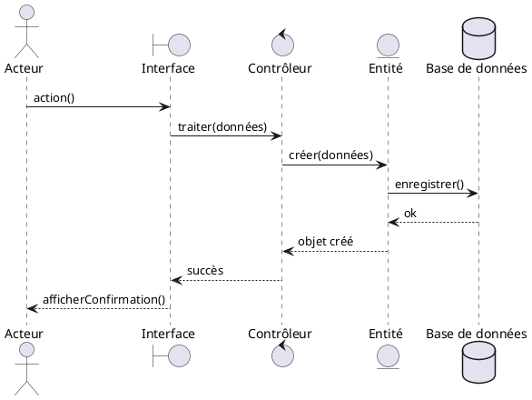

# Modèle de Diagramme de Séquence

**Projet** : [Nom du projet]  
**Groupe** : [Noms des membres]  
**Cas d'utilisation** : UC-XX - [Nom]

---

## 1. Introduction

### 1.1 Objectif du document

Ce document présente les diagrammes de séquence pour les cas d'utilisation clés du système [Nom du projet].

### 1.2 Cas d'utilisation sélectionnés

Liste des cas d'utilisation analysés dans ce document :

| ID | Nom | Justification de sélection |
|----|-----|---------------------------|
| UC-XX | [Nom] | Complexité technique / Importance métier |
| UC-YY | [Nom] | Interactions multiples |
| UC-ZZ | [Nom] | Risque identifié |

---

## 2. Conventions de modélisation

### 2.1 Participants

**Types de participants** :
- **Acteur** : Utilisateur ou système externe (bonhomme)
- **Boundary** (Frontière) : Interface utilisateur, écrans (cercle avec ligne)
- **Control** (Contrôle) : Logique métier, contrôleurs (cercle avec flèche)
- **Entity** (Entité) : Objets métier, données (cercle)

### 2.2 Messages

- **Message synchrone** : →
- **Message asynchrone** : ⇢
- **Message de retour** : - - →
- **Création d'objet** : « create »
- **Destruction d'objet** : X

### 2.3 Fragments

- **alt** : Alternative (if...else)
- **opt** : Optionnel (if)
- **loop** : Boucle (for, while)
- **par** : Parallèle
- **ref** : Référence à un autre diagramme

---

## 3. UC-XX : [Nom du cas d'utilisation]

### 3.1 Rappel du cas d'utilisation

**Description** : [Description brève du cas d'utilisation]

**Acteur(s) principal(aux)** : [Acteur]

**Objectif** : [Ce que le cas d'utilisation permet d'accomplir]

### 3.2 Scénario nominal (texte)

**Préconditions** :
- [Condition 1]
- [Condition 2]

**Étapes** :
1. L'acteur [action initiale]
2. Le système affiche [réaction]
3. L'acteur saisit [données]
4. Le système valide [traitement]
5. Le système enregistre [persistance]
6. Le système affiche [confirmation]

**Postconditions** :
- [Résultat 1]
- [Résultat 2]

### 3.3 Diagramme de séquence

#### 3.3.1 Participants identifiés

| Participant | Type | Rôle |
|-------------|------|------|
| :[Acteur] | Acteur | Utilisateur initiant l'action |
| :[InterfaceNom] | Boundary | Écran/page d'interface |
| :[ControleurNom] | Control | Logique de traitement |
| :[EntiteNom] | Entity | Objet métier |

#### 3.3.2 Diagramme

```
[Insérer ici le diagramme de séquence graphique]
```

**Format texte (PlantUML)** :


### 3.4 Description des interactions clés

**Interaction 1 : [Nom]**
- **Entre** : [Participant A] et [Participant B]
- **Message** : [Nom du message]
- **Description** : [Explication de ce qui se passe]
- **Règle métier** : [Règle appliquée si pertinent]

**Interaction 2 : [Nom]**
- **Entre** : [Participant C] et [Participant D]
- **Message** : [Nom du message]
- **Description** : [Explication]

### 3.5 Règles de gestion appliquées

- **RG-XX** : [Titre de la règle] - [Où elle est appliquée dans le diagramme]
- **RG-YY** : [Titre de la règle] - [Où elle est appliquée dans le diagramme]

### 3.6 Scénarios alternatifs

#### 3.6.1 Scénario alternatif A1 : [Titre]

**Condition de déclenchement** : [Quand ce scénario s'applique]

**Divergence à l'étape** : X du scénario nominal

**Déroulement** :
1. [Étape alternative 1]
2. [Étape alternative 2]
3. [Retour au nominal / Fin / Échec]

**Diagramme** (si pertinent) :
```
[Insérer diagramme de l'alternative ou décrire les changements]
```

#### 3.6.2 Scénario d'exception E1 : [Titre]

**Condition** : [Cas d'erreur]

**Gestion** : [Comment le système gère l'erreur]

### 3.7 Commentaires et choix de conception

**Choix 1** : [Décision prise]
- **Raison** : [Justification]
- **Alternative envisagée** : [Autre option]

**Choix 2** : [Décision prise]
- **Raison** : [Justification]

---

## 4. UC-YY : [Autre cas d'utilisation]

[Répéter la structure ci-dessus pour chaque cas d'utilisation]

### 4.1 Rappel du cas d'utilisation
### 4.2 Scénario nominal (texte)
### 4.3 Diagramme de séquence
### 4.4 Description des interactions clés
### 4.5 Règles de gestion appliquées
### 4.6 Scénarios alternatifs
### 4.7 Commentaires et choix de conception

---

## 5. Synthèse et analyse globale

### 5.1 Composants identifiés

Liste des composants (Control et Entity) identifiés à travers tous les diagrammes :

| Composant | Type | Responsabilités |
|-----------|------|-----------------|
| [ControleurA] | Control | [Description des responsabilités] |
| [EntiteA] | Entity | [Description] |
| [EntiteB] | Entity | [Description] |

### 5.2 Patterns identifiés

**Pattern 1** : [Nom du pattern]
- **Contexte** : [Où il apparaît]
- **Description** : [Comment il est implémenté]

**Pattern 2** : [Nom du pattern]
- **Contexte** : [Où il apparaît]
- **Description** : [Comment il est implémenté]

### 5.3 Points d'attention techniques

**Point 1** : [Titre]
- **Description** : [Complexité ou risque identifié]
- **Solution envisagée** : [Comment le gérer]

**Point 2** : [Titre]
- **Description** : [Complexité ou risque identifié]
- **Solution envisagée** : [Comment le gérer]

### 5.4 Cohérence avec les cas d'utilisation

Vérification de la cohérence :
- ✅ Tous les acteurs des UC apparaissent dans les diagrammes
- ✅ Tous les scénarios nominaux sont modélisés
- ✅ Les principales alternatives sont documentées
- ✅ Les règles de gestion sont appliquées

### 5.5 Préparation pour le diagramme de classes

Les entités identifiées dans ces diagrammes de séquence serviront de base pour le diagramme de classes :

| Entité (séquence) | Future classe | Attributs pressentis |
|-------------------|---------------|---------------------|
| [Entité1] | [NomClasse1] | [attr1, attr2] |
| [Entité2] | [NomClasse2] | [attr1, attr2] |

---

## 6. Matrices de traçabilité

### 6.1 UC ↔ Diagrammes de séquence

| Cas d'utilisation | Diagramme fourni | Scénarios couverts |
|-------------------|------------------|-------------------|
| UC-01 | ✓ Nominal | Nominal + 2 alternatifs |
| UC-02 | ✓ Nominal | Nominal + 1 alternatif |
| UC-03 | ✓ Nominal | Nominal uniquement |

### 6.2 Règles de gestion ↔ Diagrammes

| Règle | Appliquée dans |
|-------|----------------|
| RG-01 | UC-01 (étape 4), UC-03 (étape 2) |
| RG-02 | UC-02 (étape 5) |

---

## 7. Glossaire technique

| Terme | Définition |
|-------|------------|
| Boundary | Objet d'interface représentant l'interaction avec l'utilisateur |
| Control | Objet contrôleur gérant la logique métier |
| Entity | Objet métier représentant les données persistantes |
| Fragment | Structure de contrôle (alt, loop, opt, etc.) |

---

## 8. Outils utilisés

- **Outil de modélisation** : [draw.io / PlantUML / Visual Paradigm / etc.]
- **Format des diagrammes** : [PNG / SVG / PDF]
- **Convention de nommage** : [Standard utilisé]

---

## 9. Validation

### 9.1 Critères de validation

- [ ] Tous les cas d'utilisation sélectionnés sont modélisés
- [ ] Les diagrammes respectent la notation UML
- [ ] Les participants sont clairement identifiés
- [ ] Les messages sont nommés explicitement
- [ ] Les règles de gestion sont appliquées
- [ ] Les commentaires expliquent les choix importants
- [ ] La cohérence avec les UC est vérifiée

### 9.2 Revue

| Rôle | Nom | Date | Commentaires |
|------|-----|------|--------------|
| Équipe projet | | | |
| Encadrant | | | |

---

## Annexes

### Annexe A : Conventions PlantUML

Si vous utilisez PlantUML, voici les conventions :
```
@startuml
' Définition des participants
actor Utilisateur
boundary "Interface" as UI
control "Contrôleur" as CTRL
entity "Entité" as ENT

' Messages
Utilisateur -> UI : cliquer()
UI -> CTRL : traiter()
CTRL -> ENT : créer()

' Retour
ENT --> CTRL : objet
CTRL --> UI : succès
UI --> Utilisateur : afficher()

@enduml
```

### Annexe B : Exemple complet

[Fournir un exemple complet simple pour illustration]

### Annexe C : Références

- UML 2.5 Specification (OMG)
- Martin Fowler - UML Distilled
- Guide de notation UML
