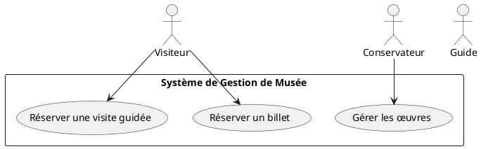
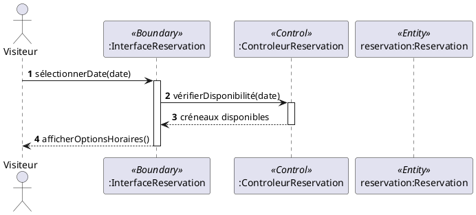
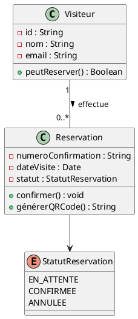
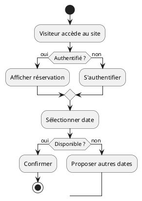

# Index PlantUML - Vue d'Ensemble

Ce document présente tous les diagrammes PlantUML disponibles pour le projet de gestion de musée.

---

## 📊 Diagrammes Disponibles

### 1. Diagramme de Cas d'Utilisation 
**Fichier** : [`diagramme_cas_utilisation.puml`](diagramme_cas_utilisation.puml)

**Contenu** :
- 4 acteurs principaux (Visiteur, Guide, Conservateur, Administrateur)
- 2 systèmes externes (Paiement, Notification)
- 15 cas d'utilisation
- Relations include/extend
- Notes explicatives

**Utilisation pédagogique** : Semaines 2-3

**Aperçu du code** :


---

### 2. Diagramme de Séquence - Réservation de Billet
**Fichier** : [`diagramme_sequence_reservation.puml`](diagramme_sequence_reservation.puml)

**Contenu** :
- 10 participants (acteur, boundaries, controls, entities)
- 36 interactions numérotées
- 4 sections logiques (sélection, calcul, création, paiement)
- Activation/désactivation des objets
- Création d'objets avec `<<create>>`
- Intégration système externe (paiement)

**Utilisation pédagogique** : Semaines 4-5

**Aperçu du code** :


---

### 3. Diagramme de Classes - Domaine Musée
**Fichier** : [`diagramme_classes_musee.puml`](diagramme_classes_musee.puml)

**Contenu** :
- 8 classes métier complètes
- 6 énumérations
- Relations avec multiplicités
- Stéréotypes (Entity, Enum)
- Notes avec règles de gestion
- Personnalisation des couleurs

**Utilisation pédagogique** : Semaines 6-7

**Aperçu du code** :


---

### 4. Diagramme d'Activité - Processus de Réservation (Bonus)
**Fichier** : [`diagramme_activite_reservation.puml`](diagramme_activite_reservation.puml)

**Contenu** :
- Flux complet du processus de réservation
- Conditions (if/then/else)
- Boucles et branchements
- Activités parallèles (fork)
- Points de départ/arrêt

**Utilisation pédagogique** : Complément optionnel

**Aperçu du code** :


---

## 🎯 Comment Utiliser Ces Diagrammes

### Méthode 1 : Copier-Coller dans l'Éditeur en Ligne

1. Ouvrez [PlantUML Online](http://www.plantuml.com/plantuml/uml)
2. Ouvrez un fichier `.puml` de ce dossier
3. Copiez tout le contenu
4. Collez dans l'éditeur en ligne
5. Le diagramme s'affiche automatiquement
6. Exportez en PNG, SVG ou PDF

### Méthode 2 : Visual Studio Code

1. Installez l'extension PlantUML
2. Ouvrez un fichier `.puml`
3. Appuyez sur `Alt+D`
4. Le diagramme s'affiche à côté

### Méthode 3 : Ligne de Commande

```bash
# Installer PlantUML
sudo apt-get install plantuml

# Générer un diagramme en PNG
plantuml diagramme_cas_utilisation.puml

# Générer tous les diagrammes
plantuml *.puml

# Générer en SVG (vectoriel)
plantuml -tsvg diagramme_classes_musee.puml
```

---

## 📝 Structure des Fichiers PlantUML

Tous les fichiers suivent cette structure :

```
@startuml NomDuDiagramme

' Configuration et styles
...

' Déclaration des éléments
...

' Relations et interactions
...

' Notes et documentation
...

@enduml
```

---

## 🎨 Personnalisation

### Changer les Couleurs

Dans n'importe quel diagramme, vous pouvez ajouter :

```plantuml
skinparam backgroundColor LightYellow
skinparam actor {
  BackgroundColor LightBlue
  BorderColor Navy
}
```

### Ajouter des Notes

```plantuml
note right of Classe
  Ceci est une note
  explicative sur
  plusieurs lignes
end note
```

### Modifier la Disposition

```plantuml
' Pour une disposition horizontale
left to right direction

' Pour grouper des éléments
package "Module A" {
  ...
}
```

---

## 📚 Ressources Complémentaires

### Documentation
- [Guide PlantUML complet](../docs/PLANTUML_GUIDE.md)
- [Documentation officielle](https://plantuml.com)
- [Exemples réels](https://real-world-plantuml.com)

### Outils
- [PlantUML Online Editor](http://www.plantuml.com/plantuml/uml)
- [VS Code Extension](https://marketplace.visualstudio.com/items?itemName=jebbs.plantuml)
- [IntelliJ Plugin](https://plugins.jetbrains.com/plugin/7017-plantuml-integration)

---

## ✅ Checklist d'Utilisation

### Pour les Étudiants

- [ ] J'ai lu le [guide PlantUML](../docs/PLANTUML_GUIDE.md)
- [ ] J'ai choisi mon outil de visualisation
- [ ] J'ai réussi à afficher un diagramme
- [ ] Je comprends la syntaxe de base
- [ ] Je peux modifier les exemples pour mon projet
- [ ] Je peux exporter mes diagrammes

### Pour les Enseignants

- [ ] Les étudiants ont accès aux fichiers .puml
- [ ] Le guide est distribué
- [ ] Un outil de visualisation est recommandé
- [ ] Les exemples correspondent au cours
- [ ] Les diagrammes sont à jour avec le projet

---

## 🔄 Maintenance

Ces diagrammes sont maintenus en parallèle avec le projet. Si le système évolue :

1. Modifiez le fichier `.puml` concerné
2. Régénérez le diagramme
3. Vérifiez la cohérence avec les autres diagrammes
4. Committez les changements dans Git

---

## 💡 Conseils Pratiques

### Pour Débuter
1. Commencez par le diagramme de cas d'utilisation (le plus simple)
2. Passez au diagramme de séquence (interactions)
3. Terminez par le diagramme de classes (le plus complexe)

### Pour Aller Vite
- Copiez un diagramme existant comme base
- Modifiez progressivement pour votre projet
- Testez régulièrement le rendu

### Pour la Qualité
- Ajoutez des commentaires dans le code
- Utilisez des notes pour expliquer
- Vérifiez la lisibilité du rendu
- Demandez un retour à vos pairs

---

**Ces diagrammes PlantUML sont prêts à l'emploi pour votre projet de gestion de musée ! 🎨**
