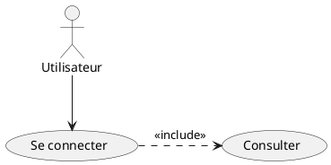
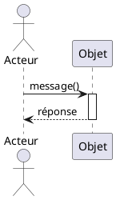
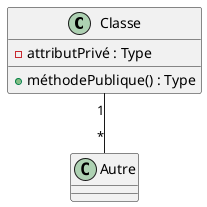

# Diagrammes PlantUML - Système de Gestion de Musée

Ce dossier contient les fichiers source PlantUML pour générer les diagrammes UML du système de gestion de musée.

## 📁 Fichiers disponibles

### 1. `diagramme_cas_utilisation.puml`
**Diagramme de cas d'utilisation** montrant :
- Les acteurs : Visiteur, Guide, Conservateur, Administrateur
- Les cas d'utilisation principaux
- Les relations include/extend
- Les interactions avec les systèmes externes

### 2. `diagramme_sequence_reservation.puml`
**Diagramme de séquence** pour le cas d'utilisation "Réserver un billet" :
- Scénario nominal complet
- Interactions entre Boundary, Control et Entity
- Intégration avec le système de paiement
- Génération du QR code

### 3. `diagramme_classes_musee.puml`
**Diagramme de classes métier** comprenant :
- 8 classes principales (Visiteur, Oeuvre, Exposition, Billet, etc.)
- 6 énumérations (TypeVisiteur, TypeBillet, StyleArtistique, etc.)
- Relations complètes avec multiplicités
- Règles de gestion documentées

---

## 🚀 Comment générer les diagrammes

### Option 1 : En ligne avec PlantUML Server

1. Allez sur [http://www.plantuml.com/plantuml/uml](http://www.plantuml.com/plantuml/uml)
2. Copiez le contenu d'un fichier .puml
3. Collez-le dans l'éditeur
4. Le diagramme s'affiche automatiquement
5. Téléchargez en PNG, SVG ou PDF

### Option 2 : Avec Visual Studio Code

1. Installez l'extension "PlantUML" de jebbs
2. Ouvrez un fichier .puml
3. Appuyez sur `Alt+D` (Windows/Linux) ou `Option+D` (Mac)
4. Le diagramme s'affiche dans un panneau à côté
5. Clic droit → "Export Current Diagram" pour sauvegarder

### Option 3 : Avec l'outil en ligne de commande

```bash
# Installation (si Java est installé)
sudo apt-get install plantuml  # Linux
brew install plantuml           # MacOS

# Générer un diagramme
plantuml diagramme_cas_utilisation.puml

# Générer tous les diagrammes
plantuml *.puml

# Générer en SVG
plantuml -tsvg diagramme_classes_musee.puml
```

### Option 4 : Avec IntelliJ IDEA / PyCharm

1. Installez le plugin "PlantUML integration"
2. Ouvrez un fichier .puml
3. Le diagramme s'affiche automatiquement à droite
4. Clic droit → "Copy / Export" pour sauvegarder

---

## 📝 Syntaxe PlantUML - Aide-mémoire

### Diagramme de cas d'utilisation



### Diagramme de séquence



### Diagramme de classes



---

## 🎨 Personnalisation

### Changer les couleurs

```plantuml
skinparam class {
    BackgroundColor LightBlue
    BorderColor Navy
}
```

### Ajouter des notes

```plantuml
note right of Classe
  Ceci est une note
  explicative
end note
```

### Modifier l'orientation

```plantuml
left to right direction  ' pour disposition horizontale
```

---

## 📚 Ressources

- **Site officiel** : [https://plantuml.com](https://plantuml.com)
- **Guide complet** : [https://plantuml.com/fr/guide](https://plantuml.com/fr/guide)
- **Exemples** : [https://real-world-plantuml.com](https://real-world-plantuml.com)
- **Playground** : [https://www.plantuml.com/plantuml](https://www.plantuml.com/plantuml)

---

## ✅ Conseils d'utilisation

1. **Commencez simple** : Créez d'abord un diagramme basique, puis ajoutez progressivement les détails
2. **Utilisez les commentaires** : `' Ceci est un commentaire` pour documenter votre code
3. **Groupez logiquement** : Utilisez des packages ou des rectangles pour organiser
4. **Testez régulièrement** : Visualisez souvent pour vérifier que le rendu correspond à vos attentes
5. **Versionnez vos diagrammes** : Les fichiers .puml sont du texte, parfaits pour Git

---

## 🔄 Mise à jour des diagrammes

Pour modifier un diagramme :
1. Ouvrez le fichier .puml correspondant
2. Modifiez le code PlantUML
3. Régénérez le diagramme
4. Vérifiez que les changements sont corrects
5. Committez les changements dans Git

---

**Note** : Ces diagrammes font partie du projet pédagogique pour enseigner UML aux étudiants L2. Ils illustrent un système complet de gestion de musée.
